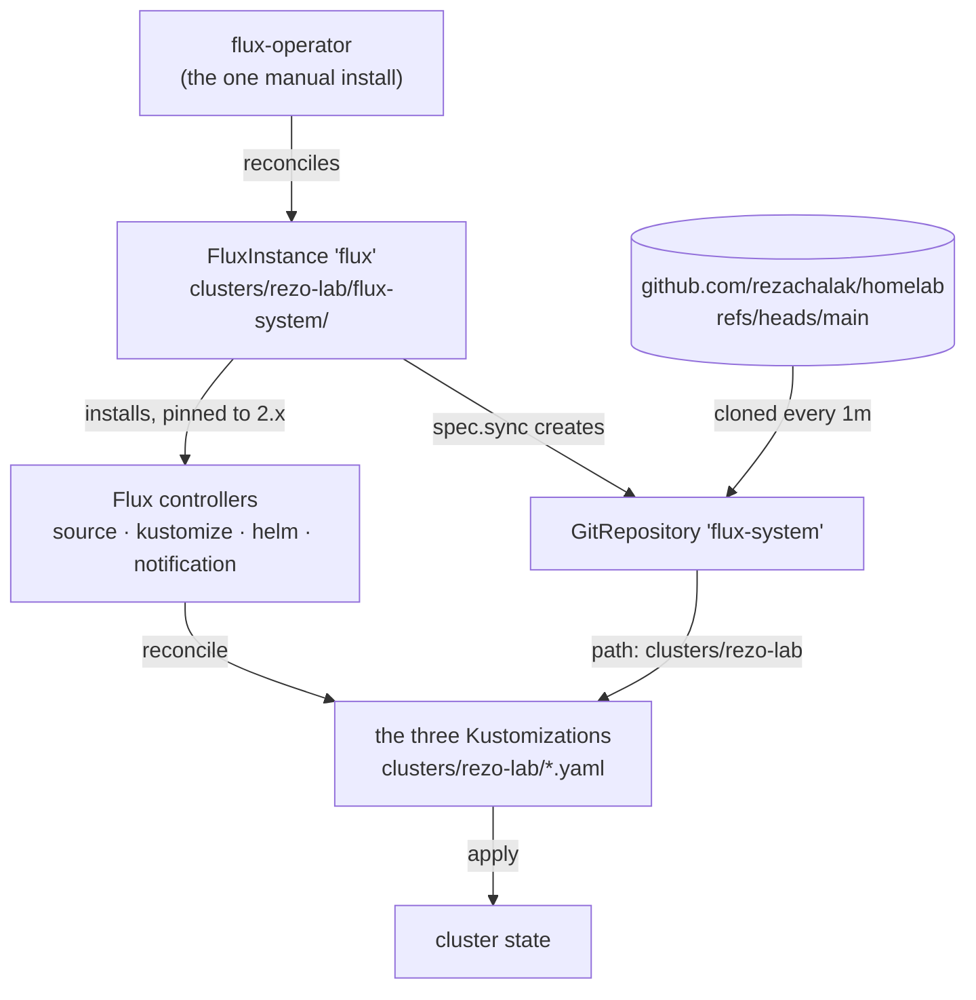
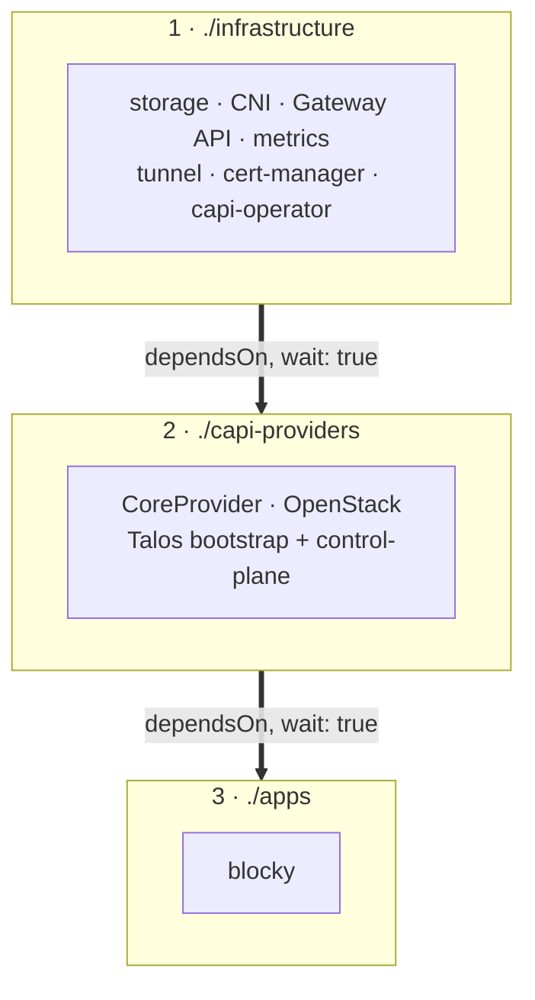
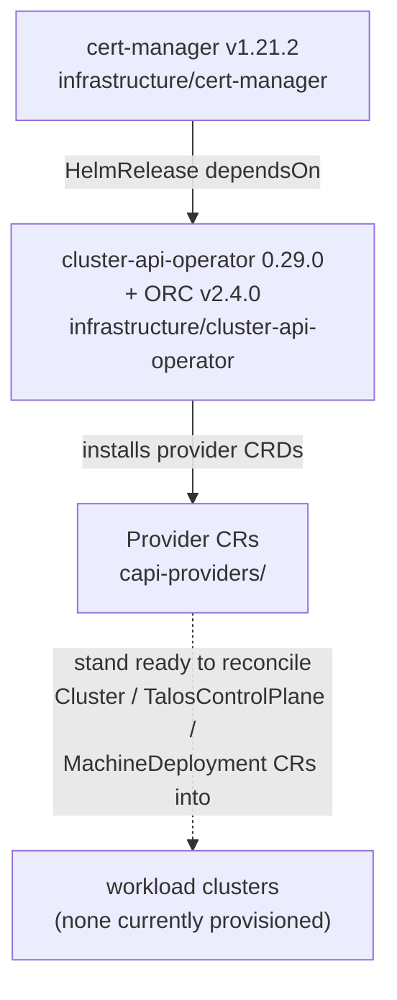

# homelab

My homelab, managed with GitOps. [Flux](https://fluxcd.io/) watches this repo and
reconciles everything into the cluster — there is nothing to `kubectl apply` by hand.

## How the GitOps loop works

Flux itself is installed and kept up to date by the
[flux-operator](https://fluxcd.control-plane.io/operator/), driven by a single
`FluxInstance` resource:



The only manual step is installing the flux-operator. Everything below it — the Flux
controllers, the `GitRepository`, and the `FluxInstance` itself, since
`flux-instance.yaml` sits inside the synced path — is reconciled from git.

`clusters/rezo-lab` is the only path Flux is pointed at, and all it contains is three
`Kustomization` objects that pull in the rest of the repo, in order:



Each arrow is a `dependsOn` with `wait: true`, so a stage only starts once everything
in the previous one reports Ready. `apps` depends on both of the stages above it.

## Repo layout

```
clusters/rezo-lab/     Flux entrypoint — the only path Flux reads
  flux-system/         FluxInstance: what Flux itself runs as
  infrastructure.yaml  \
  capi-providers.yaml   >  the three Kustomizations above
  apps.yaml            /
infrastructure/        cluster-level plumbing: CNI, storage, ingress, CAPI operator
capi-providers/        Cluster API provider CRs (split out; see below)
apps/                  the actual workloads
```

## The management cluster

`rezo-lab` is a single-node [Talos](https://www.talos.dev/) cluster on the home LAN
(`192.168.25.0/24`, internal domain `rezoreyz.lan`). Its machine config lives in a
separate repo (`my-talos`) — this one starts at the point where Flux is already
running.

| | |
|---|---|
| Flux sync | `https://github.com/rezachalak/homelab`, `main`, every 1m |
| LoadBalancer pool | `192.168.25.100`–`192.168.25.105` (Cilium LB-IPAM + L2 announcements) |
| `.100` | Blocky — LAN DNS (TCP + UDP share the IP via `sharing-key`) |
| `.101` | Cilium Gateway — HTTP for `*.rezoreyz.lan` |

## Platform components

Everything in `infrastructure/` that isn't Cluster API:

| Component | Version | Notes |
|---|---|---|
| `local-path-provisioner` | chart from git `main` | default StorageClass, backed by `/var/mnt/data` (the dedicated 322GB disk provisioned as a Talos user volume) |
| `gateway-api-crds` | v1.6.1 | standard CRDs, pulled straight from upstream |
| `cilium` | 1.20.x | CNI, kube-proxy replacement via Talos KubePrism (`localhost:7445`), L2 announcements, Gateway API, Hubble relay + UI |
| `gateway` | — | the `Gateway` on `.101` plus the `hubble.rezoreyz.lan` route |
| `metrics-server` | latest | `--kubelet-insecure-tls` |
| `cloudflared` | image `2026.8.2` | remotely-managed tunnel, 2 replicas |

## Apps

The only workload in `apps/` right now is Blocky.

**`blocky`** — LAN DNS on `192.168.25.100`. DoH upstreams (Quad9, Cloudflare) with
`parallel_best`, StevenBlack's list for ad blocking, and a `customDNS` entry mapping
`rezoreyz.lan` to the gateway. Blocky has no runtime-mutable state, so the config
block in `release.yaml` is the actual source of truth.

## Cluster API

The cluster runs [Cluster API](https://cluster-api.sigs.k8s.io/) so it can provision
further Kubernetes clusters declaratively. This spans all three stages of the chain:



### Providers

| Provider | Version |
|---|---|
| CoreProvider `cluster-api` | v1.12.11 |
| InfrastructureProvider `openstack` | v0.14.8 |
| BootstrapProvider `talos` | v0.6.12 |
| ControlPlaneProvider `talos` | v0.5.13 |

The Talos providers aren't names the operator resolves on its own, so they carry an
explicit `fetchConfig` pointing at siderolabs' release manifests. The operator also
needs [ORC](https://github.com/k-orc/openstack-resource-controller), applied straight
from its release manifest since it isn't part of the provider CR contract.

### Why the provider CRs are a separate Kustomization

They'd naturally sit next to the operator's `HelmRelease`, but Flux applies one
Kustomization as a single sorted batch — so the CRs get dry-run validated against
CRDs the release in that same batch hasn't installed yet. Splitting them into their
own top-level Kustomization lets `dependsOn` order the two properly.

### Workload clusters

None at the moment. A `talos-lab` cluster (1 control-plane + 1 worker on a DevStack
without Octavia) lived in `apps/talos-lab-cluster/` until it was torn down on
2026-10-04; the manifests are in git history if they're wanted as a starting point.

The providers above stay installed so a new cluster is just a matter of adding the
`Cluster` / `TalosControlPlane` / `MachineDeployment` manifests back under `apps/`.
Provisioning against OpenStack also needs a credentials Secret (`clouds.yaml`) in the
target namespace, created out of band.

## Secrets

Nothing sensitive is committed. This Secret is created out of band and referenced
from the manifests:

| Secret | Namespace | Used by |
|---|---|---|
| `cloudflared-token` | `cloudflared` | tunnel token, injected via `valuesFrom` at render time |

## License

Apache 2.0 — see [LICENSE](LICENSE).
